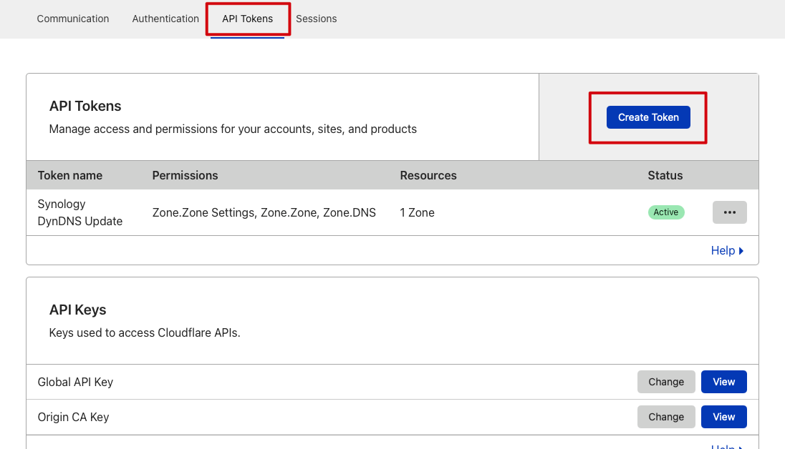
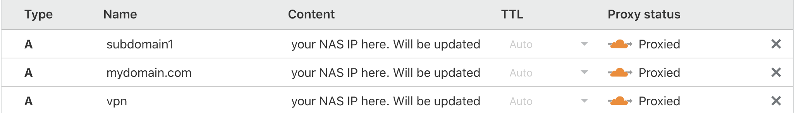
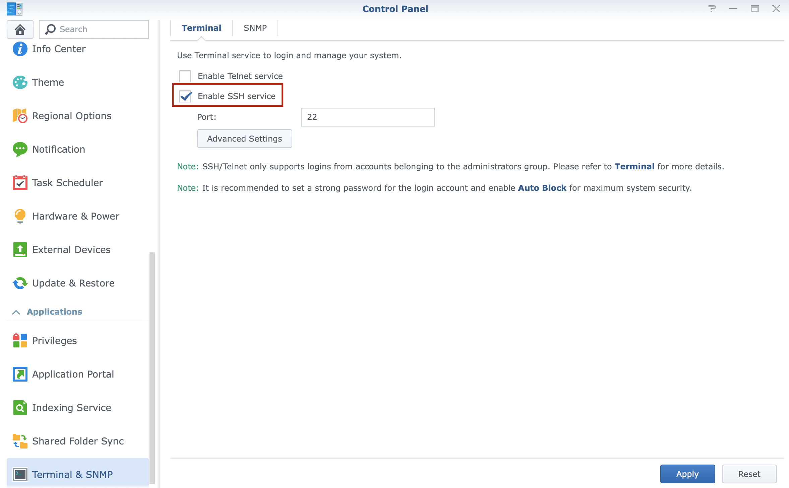
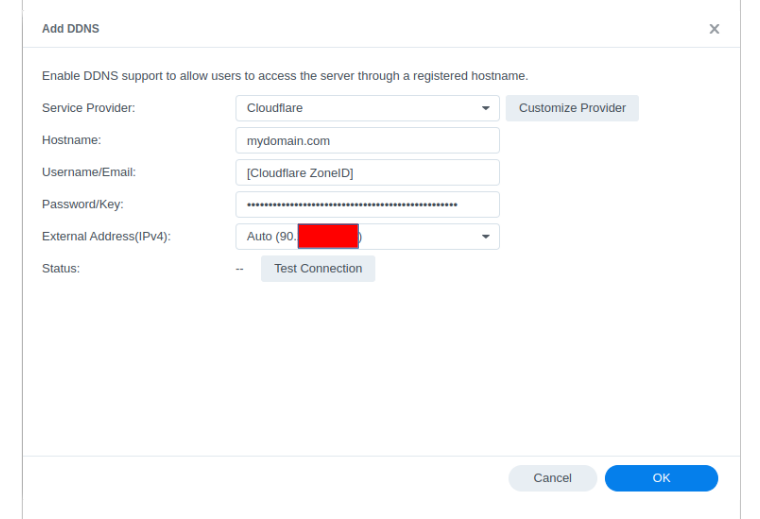

# Cloudflare DDNS provider for Synology

## What this script does

* A Python script for Synology DSM adding support for Cloudflare to Control Panel > External Access > Dynamic DNS (DDNS).
* Supports single domain
* Easy instalation process
* Based on CloudFlare API v4

## Before you begin

Before starting the installation process, make sure you have (and know) the following information, or have completed these steps:

1. *Cloudflare credentials:*

    a. Know your Cloudflare account username (or [register for an account if you're new to Cloudflare](https://dash.cloudflare.com/sign-up)); and

    b. Have your [API key](https://dash.cloudflare.com/profile/api-tokens) - no need to use your Global API key! (More info: [API keys](https://support.cloudflare.com/hc/en-us/articles/200167836-Managing-API-Tokens-and-Keys)).

    

    c. Create a API key with following (3) permissions:

    **Zone** > **Zone.Settings** > **Read**  
    **Zone** > **Zone** > **Read**  
    **Zone** > **DNS** > **Edit**  

    The affected zone ressouces have to be (at least):

    **Include** > **All zones from an account** > `<domain>`  

2. *DNS settings:*

    Ensure the DNS A record(s) for the domain/zone(s) you wish to update with this script have been created (More information: [Managing DNS records](https://support.cloudflare.com/hc/en-us/articles/360019093151-Managing-DNS-records-in-Cloudflare)).

    Your DNS records should appear (or already be setup as follows) in Cloudflare:

    (Note: Having Proxied turned on for your A records isn't necessary, but it will prevent those snooping around from easily finding out your current IP address)

    

3. *SSH access to your Synology device:*

    If you haven't setup this access, see the following Synology Knowledge Base article:
    [How can I sign in to DSM/SRM with root privilege via SSH?](https://kb.synology.com/en-id/DSM/tutorial/How_to_login_to_DSM_with_root_permission_via_SSH_Telnet)

4. *Knowledge of vi:*

    vi is the only text editor available within the [Busybox](https://linux.die.net/man/1/busybox) environment available at the SSH command line on devices running SRM.

    For assistance with vi commands, see:
    [Basic vi commands](https://www.cs.colostate.edu/helpdocs/vi.html)

## How to install

1. **SSH with root privledges on your supported device:**

    Navigate to **Control Panel > Terminal & SNMP > Enable SSH service**

    

2. **Connect via SSH:** Connect to your supported device via SSH and become `root` user. Then execute command

    ```bash
    wget  -O - https://raw.githubusercontent.com/marcosepp/SynologyCloudflareDDNS/master/install.sh | bash
    ```

3. **Update your DDNS settings:**

    Navigate to **Control Panel > External Access > DDNS** then add new DDNS

    Add/Update the DDNS settings screen as follows:

    * Service provider: Select Cloudflare
    * Hostname: **mydomain.com**
    * Username: Cloudflare ZoneID ([Cloudflare: Find zone and account IDs](https://developers.cloudflare.com/fundamentals/setup/find-account-and-zone-ids/))
    * Password: Your created Cloudflare API Key
    * External IP: "Auto( **your.external.i.p** )"

    

    Finally, press the test connection button to confirm all information is correctly entered, before pressing Ok to save and confirm your details.

4. Enjoy 🍺 and **don't forget to deactivate SSH (step 1) if you don't need it**.

## Credits

Github: [mrikirill/SynologyDDNSCloudflareMultidomain](https://github.com/mrikirill/SynologyDDNSCloudflareMultidomain)

## License

MIT
